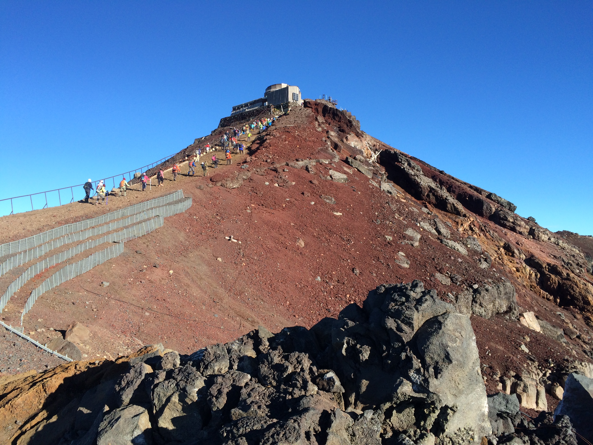

# About
プログラミング初心者です。
機械学習に興味があります。

## Profile
- ynori822
- 東京都
- 2020年3月より学習開始

# Skills
- OS                Windows, Ubuntu
- Language          Javascript
- Engine,Frameworks Node.js, Express
- Tool,MiddleWare   Git, PostgresSQL

# Works
- [GitHub](https://github.com/ynori822)
- 作った作品
  - [秘密の匿名掲示板](https://warm-cliffs-59742.herokuapp.com/posts)
  - [予定調整くん](https://blooming-wave-19578.herokuapp.com/)
  
<iframe src="https://www.openprocessing.org/sketch/1035466/embed/" width="800" height="600"></iframe>
